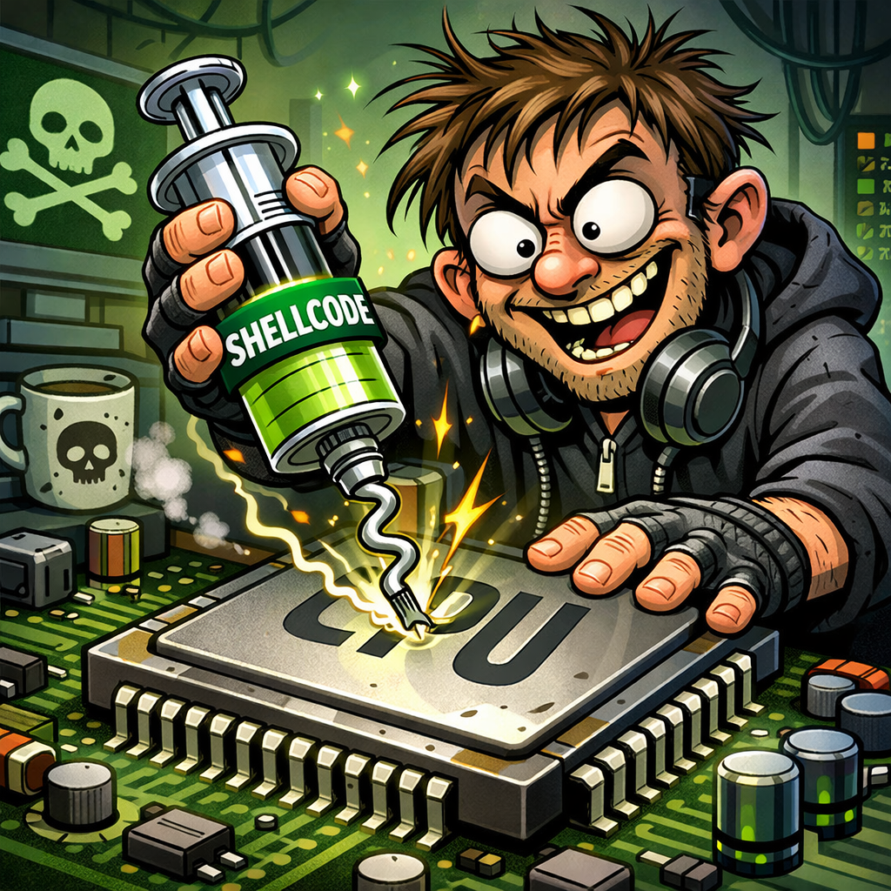
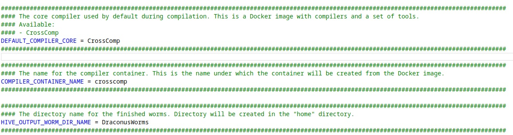
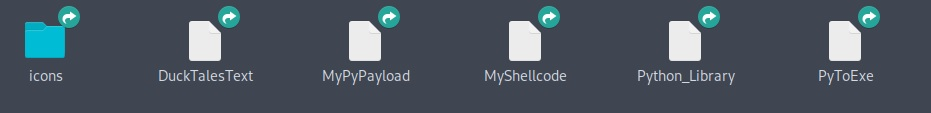
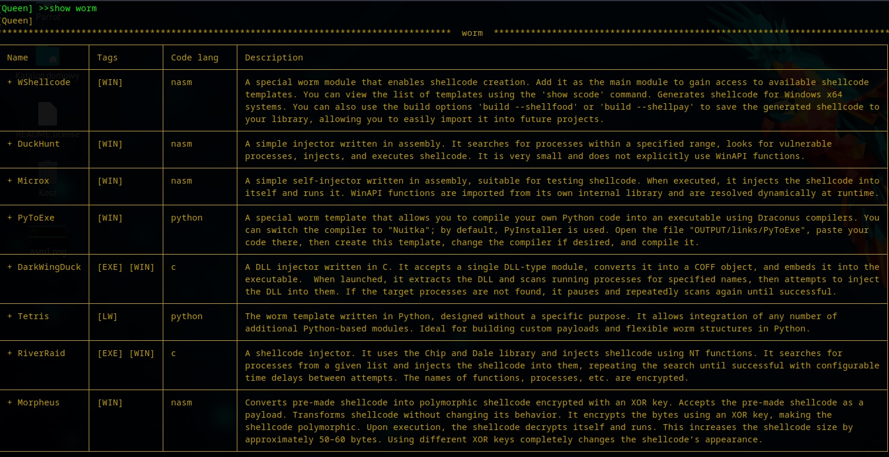
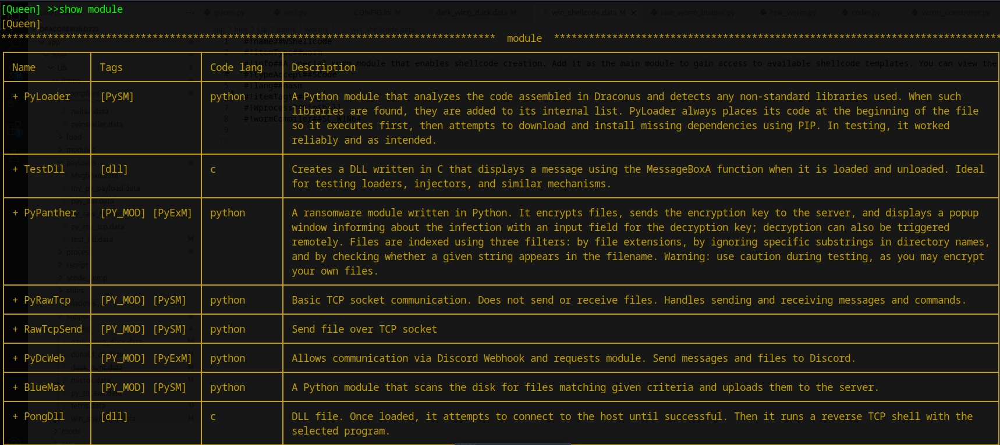
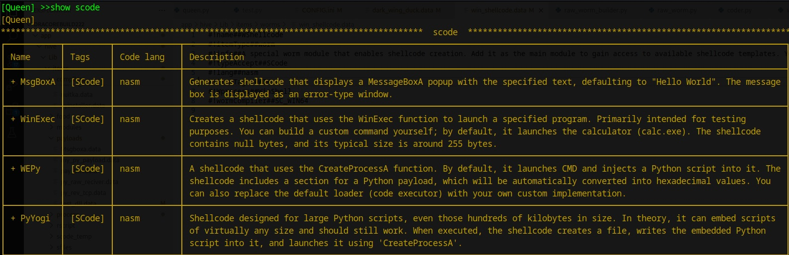
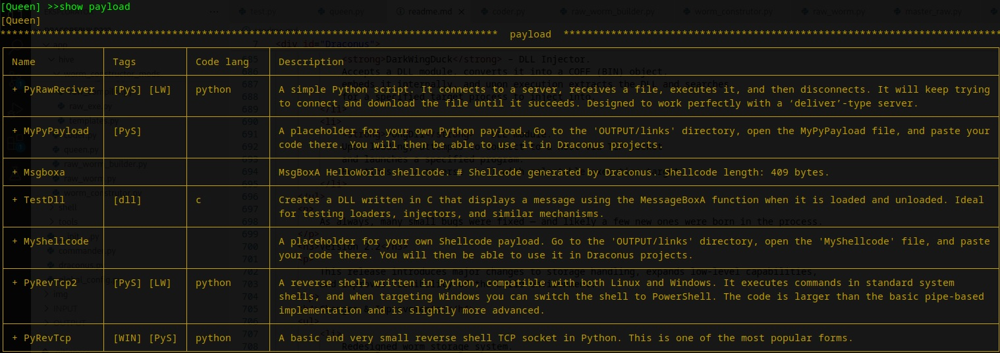
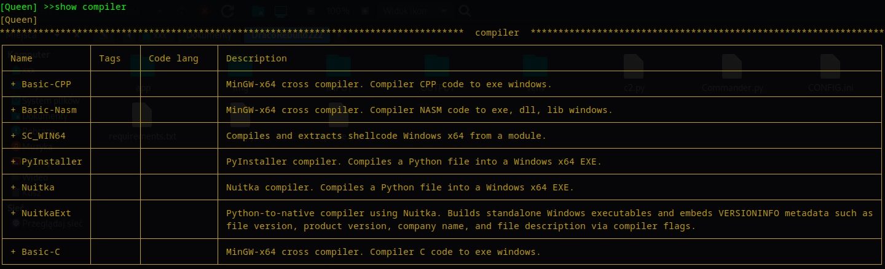
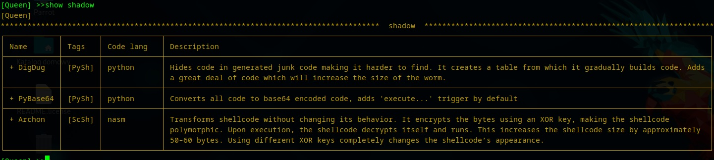

<!DOCTYPE markdown>
<html>
<head>
</head>
<body>

    <h1 align="center">Draconus</h1>
    

        
    

    <h4 align="center">Hack yourself first. Others will follow.</h4>
    

    This project is essentially the legacy of a poor noob who desperately wanted to become a hacker,
    but the only thing he ever successfully hacked was his own computer.
    Hundreds of hours spent carving something out of code tend to produce strange ideas along the way.
    

    

    If you are curious how injectors, shellcode, and similar mechanisms are created and how they actually work,
    you will likely find something interesting here.
    Draconus focuses on building rather basic tools, but the system is designed in a way that allows them
    to be extended, modified, and improved.
    

    

    If you are looking for a highly advanced, professional-grade framework,
    projects like Metasploit will serve you better.
    That said, even simple toys can sometimes walk quietly past an antivirus without being noticed.
    

    <h2>Features and Advantages</h2>
    <ul>
    <li><strong>Cross-Compilation Environment</strong>: Includes a custom Docker image preloaded with compilers for Assembly, C, C++, PyInstaller, and Nuitka, allowing seamless creation of Windows executables directly from Linux.</li>
    <li><strong>Flexible Server Framework</strong>: Provides multiple listener types with a lightweight management system to handle connections, file transfers, raw byte streams, and advanced command-based communication.</li>
    <li><strong>Executable Building from Source</strong>: Every EXE or DLL is generated starting from raw code, ensuring each build is unique and minimizing static signatures that appear in typical compiled malware.</li>
    <li><strong>Support for Complex Dependencies</strong>: Easily builds executables that require additional static or dynamic libraries. The build system automatically resolves and packages dependencies.</li>
    <li><strong>Modular Build System</strong>: Allows constructing EXEs and libraries in a layered fashion—one library can depend on another, and everything can be bundled into the final executable without user-side complexity.</li>
    <li><strong>Payload Creation Toolkit</strong>: Enables building custom payloads—primarily in Python—using ready-to-use modules. No programming knowledge is required to assemble functional payloads.</li>
    <li><strong>Highly Customizable Architecture</strong>: Every executable or library is built from modular pieces, enabling endless combinations and permitting small, specialized, and stealthy builds.</li>
    <li><strong>Shellcode Generation</strong>: Create custom shellcode for experimentation, analysis, and chaining with other payloads.</li>
    <li><strong>Code Obfuscation & Packing</strong>: Offers tools to obfuscate Python and assembly code, pack scripts into a single line, and experiment with evasion techniques in a safe, educational environment.</li>
    <li><strong>Integrated C2 Framework</strong>: Features built-in command-and-control functionality with support for multiple simultaneous clients, automated tasks, and structured communication channels.</li>
    <li><strong>Designed for Learning & Experimentation</strong>: Draconus is built as a safe playground for exploring malware techniques, cross-compilation, payload design, shellcoding, and low-level Windows/Linux internals.</li>
</ul>

    <h2>Disclaimer</h2>
    

    <strong>This toolkit is developed solely for ethical and educational purposes to deepen understanding of malware creation and analysis. Using this tool to target other users, conduct attacks without prior consent, or apply it in unauthorized environments is strictly forbidden. The responsibility for proper use rests entirely on the user. Caution is advised! Misuse could harm your system or other users. We highly recommend using this tool within isolated virtual machines.</strong>
    

    <h2>About</h2>
    

    Draconus is composed of two core components that work together to create a flexible, modular experimentation environment.
    

    

    <strong>Draconus</strong> itself runs quietly in the background, creating servers, managing connections, and handling all automated tasks. Once launched, it can operate indefinitely without user interaction, maintaining listeners and managing clients on its own.
    

    

    The second component, <strong>Commander</strong>, serves as the interactive interface for communicating with the background service. Through a console-style command system built with Python Click, users can issue commands, manage servers, inspect connections, and generate payloads.
    

    

    Commander also provides access to the <strong>Hive</strong> section, a workspace dedicated to creating payloads, modules, shellcode, and various building blocks used throughout the project. Hive simplifies the creation process, enabling users to assemble complex components from ready-made modules.
    

    

    Although Draconus is not as advanced or extensive as large-scale professional frameworks such as Metasploit, it takes inspiration from some of their ideas. The project is developed as a hobby initiative, exploring different approaches, techniques, and learning opportunities. Features like shellcode generation and payload embedding are present, but implemented in a way suited to the project’s unique design and philosophy.
    

    <h2>Contents</h2>
    <ul>
        <li><a href="#Draconus">Draconus</a></li>
        <li><a href="#Disclaimer">Disclaimer</a></li>
        <li><a href="#About">About</a></li>
        <li><a href="#Install">Install</a></li>
        <li><a href="#Start">Start</a></li>
        <li><a href="#FirstRun">First Run</a></li>
        <li><a href="#Hive">Hive</a></li>
        <li><a href="#ModuleTypes">Module Types</a></li>
        <li><a href="#Variables">Variables</a></li>
        <li><a href="#HiveCommands">Hive Commands</a></li>
        <li><a href="#HiveExamples">Hive Examples</a></li>
        <li><a href="#Tips">Tips and Tricks</a></li>
        <li><a href="#ToolsList">Modules List</a></li>
        <li><a href="#Contributing">Contributing</a></li>
        <li><a href="#Changelog">Changelog</a></li>
    </ul>

    <h2>Installation</h2>
    <ol>
        <li>Ensure you have Python 3.11.2 or a newer version installed on your system.</li>
        <li>Install Docker (e.g., using the following command):
            <pre><code>sudo apt install docker.io</code></pre>
        </li>
        <li>To allow the program to interact with Docker, you need to set the appropriate permissions. Run:
            <pre><code>sudo usermod -aG docker $USER</code></pre>
            Afterward, log out and back in (or restart your system) to apply the new permissions.
        </li>
        <li>Due to the recent policy changes in Python modules on Linux, make sure you have Python’s virtual environment package, <code>venv</code>, installed. If not, install it with:
            <pre><code>sudo apt install python3.11-venv</code></pre>
        </li>
    </ol>
    
The installation is complete, and your environment is ready to use.

    <h2>Start</h2>
    

    Before launching Draconus for the first time, review the <strong>CONFIG.ini</strong> file. This file defines the core runtime parameters of the project. One of the most important settings is the <strong>IP</strong> value, which should be set to your machine’s IP address. It will be used automatically when generating servers and payloads.  
    

    

    The configuration file also allows you to customize message colors, adjust maximum console width, and modify various other visual and functional options. All available parameters are documented directly inside the file.
    

    <h3>1. Starting Draconus</h3>
    

    The main background service is <strong>Draconus</strong>. It is designed to run continuously and independently, either in a separate console window or in the background.  
    

    

    To start it normally, run:
    

    <pre><code>python3 Draconus.py</code></pre>
    

    During the first launch, a built-in loader will automatically create a virtual environment and install all required packages.
    

    

    To run Draconus in the background, you can use:
    

    <pre><code>nohup python3 Draconus.py &amp;</code></pre>
    

    Draconus will continue running until manually terminated.
    

    <h3>2. Starting Commander</h3>
    

    Once Draconus is running, you can launch the control interface: <strong>Commander</strong>.  
    The program will not start unless it detects an active Draconus instance.
    

    

    Start Commander using:
    

    <pre><code>python3 c2.py</code></pre>
    

    If the connection succeeds, you will see a confirmation message indicating that Commander has successfully linked with Draconus. From here, you can manage servers, inspect connections, and access the Hive section for creating payloads, modules, and shellcode.
    

    <h2>First Run</h2>
    
When you start Draconus, a directory named <code>OUTPUT</code> will appear in its main directory. This is a critical folder where Draconus stores its logs, downloaded files, created worms, and more. Do not delete this directory while the program is running. You can safely delete it only when both Draconus and Commander are stopped.

    <h4>Contents of the <code>OUTPUT</code> Directory:</h4>
    <ul>
    <li>
        <strong>Logs</strong> - This folder contains log files. Every message displayed by Draconus is saved here, along with a timestamp. 
        Similarly, any message received from clients is also logged.
    </li>
    <li>
        <strong>Loot</strong> - This folder stores files downloaded from or sent by clients. It will contain subdirectories named after the IP addresses of clients, which will hold the files sent by them. 
        Think of the <code>Loot</code> folder as the treasure chest for files received from clients.
    </li>
    <li>
        <strong>Hive</strong> - This folder contains files related to worms, source code, shellcodes, and ready-to-use executables. 
        If you create a worm, it will be stored here.
          
        Starting from version <strong>2.2</strong>, the <code>Hive</code> directory is implemented as a shortcut pointing to a directory located in the user's <code>home</code> folder. 
        The actual Hive workspace is now created there, while the folder inside the project serves only as a link.
         
        This change allows Draconus and its Docker images to be updated independently without requiring a full reinstallation 
        or risking the loss of previously created worms, payloads, and build artifacts.
         
        

            
        

    </li>
    <li>
        <strong>Links</strong> - This folder provides shortcuts to various useful resources in the project, so you don't have to search for them manually. 
        It includes:
        <ul>
        <li>A folder with icons where you can add your own icons and use them when creating worms.</li>
        <li>A shortcut to files where you can add custom code, for example, to payloads.</li>
        

            
        

        </ul>
  </li>
    </ul>
    <h3>Using Commands</h3>
    

        This README does not describe every Draconus command in detail, because the program itself provides extensive,
        built-in documentation.  
    

    

        By typing <code>help</code> inside Commander, you will see a full list of available commands together with their explanations.
        Many commands also include additional documentation available through the <code>--help</code> parameter, for example:  
    

    <pre><code>server --help</code></pre>
    

        This will show descriptions of available server types, their parameters, and usage examples.
    

    

        Each connected client is automatically assigned a unique ID.  
        To interact directly with a client, simply use:
    

    <pre><code>conn &lt;ID&gt;</code></pre>
    

        All of this is clearly documented inside the built-in help system.
    

    

        The <strong>Hive</strong> section, which will be described later in this README, is more advanced than the basic command layer.
        Since Hive enables building payloads, modules, shellcode, worms, and more, its structure and commands are explained here in additional detail.
    

    <h2>--------- Hive ----------</h2>

    <h3>Module Types</h3>
    

        Hive is built around different module types, each serving a specific role in the construction process:
    

    <ul>
        <li>
            <strong>worm</strong>  
            The primary module and the starting point of every project.  
            It defines the type of worm being created, such as shellcode, Python script, standalone executable, or DLL.
            The selected worm type determines whether additional modules or payloads can be embedded.
        </li>
        <li>
            <strong>module</strong>  
            Optional extensions that enhance or modify the behavior of a worm.  
            Not every worm template supports modules, while some templates are built entirely from modular components.
            Modules may consist of raw code snippets, dynamic DLLs, or static libraries.
        </li>
        <li>
            <strong>payload</strong>  
            Prebuilt functional components written in various languages.
            Worms or modules may expose dedicated injection points for payloads.
            Payloads are handled differently by the build system than modules,
            which is why similar functionality may exist in both forms.
        </li>
        <li>
            <strong>shadow</strong>  
            Code obfuscation components.  
            These modules transform source code into a heavily obscured and difficult-to-analyze form.
        </li>
        <li>
            <strong>scode</strong>  
            Templates for the shellcode generator.
            This category contains predefined shellcode types that can be generated on demand.
            Generated shellcode is exported in three popular formats for easy integration.
        </li>
        <li>
            <strong>rscript</strong>  
            Resource script (<code>.rc</code>) files included during the compilation process.
            They define metadata such as version number, application description, and other resource information,
            allowing the resulting executable to resemble a legitimate application.
            Most values are generated automatically using data from <code>food</code>,
            but users may override them with custom values.
        </li>
        <li>
            <strong>compiler</strong>  
            Compiler and linker scripts used during the build process.
            Each worm template has a default compiler configuration,
            but it can be replaced or modified.
            For example, Python-based worms can be compiled using either PyInstaller or Nuitka.
        </li>
        <li>
            <strong>food</strong>  
            Supporting data used by worms and modules.
            This includes text databases, link collections, naming resources, and specialized string sequences
            required by certain libraries.  
            Draconus uses <code>food</code> when generating application names, descriptions,
            metadata, and other contextual elements.
        </li>
        <li>
            <strong>support</strong>  
            Internal helper modules automatically added and managed by Draconus.
            These components provide auxiliary functionality required by other modules
            and are not intended to be modified manually.
        </li>
        <li>
            <strong>sfile</strong> (support file)  
            Additional files automatically attached during the build process.
            These may include auxiliary binaries, configuration files, or data blobs
            required by the final executable.
        </li>
        <li>
            <strong>wprocess</strong>  
            Defines the complete build workflow of a worm.
            This component controls how modules, payloads, compilers, and resources are combined.
            It is added and managed automatically by Draconus and represents the internal build pipeline.
        </li>
    </ul>

    <h2>Variables (var)</h2>
    

        Variables (<code>var</code>) are one of the most important elements in the worm creation process.
        They are responsible for configuring behavior, parameters, and runtime values used by worms,
        modules, and payloads.
    

    

        Every added template—whether it is a main <strong>worm</strong> template or a regular module—may define
        its own configurable variables. These variables are used to control things such as network settings,
        execution behavior, payload options, and build-time parameters.
    

    

        To view the current configuration and state of the worm being built, use the command:
    

    <pre><code>worm</code></pre>
    

        This command displays all active modules and their associated variables.
        Many variables come with default values that can be modified as needed.
        The most common examples include IP addresses, port numbers, and execution options.
    

    <h3>Setting Variables</h3>
    

        Variables are set using the following command syntax:
    

    <pre><code>var [variable_name] "[value]"</code></pre>
    

        <strong>Important:</strong>  
        Always enclose the value in double quotes (<code>" "</code>).
        This prevents parsing errors, especially when the value contains spaces or special characters.
    

    <h3>Using Food as Variable Input</h3>
    

        Variables can also be populated using entries from the <strong>food</strong> section.
        This is especially useful when assigning large datasets or complex values that would be
        impractical or error-prone to paste directly into the console.
    

    

        To assign a food entry to a variable, use:
    

    <pre><code>var -f [variable_name] [food_name]</code></pre>
    

        This allows Draconus to automatically inject predefined content into the variable,
        such as text blocks, link lists, or specialized string sequences.
    

    <h3>Additional Help</h3>
    

        For a full list of options and advanced usage, use:
    

    <pre><code>var --help</code></pre>

    <h2>Hive Commands</h2>
    

        The Hive section provides a dedicated set of commands used to create, configure, and build worms,
        payloads, modules, and other components. These commands control the entire build lifecycle,
        from initialization to final compilation.
    

    <h3>Available Commands</h3>
    <ul>
        <li>
            <strong>install</strong> 
            Downloads and installs the required Docker image containing all necessary compilers and build tools.
            This command is only required if the image is not already present on the system.
        </li>
        <li>
            <strong>reset</strong> 
            Creates a new worm template.  
            Removes all currently added modules, variables, and settings, effectively resetting the build process
            and starting a new project from scratch.
        </li>
        <li>
            <strong>name [name]</strong> 
            Assigns a name to the worm being created.  
            This name is used during the build process and may appear in metadata, output files, and logs.
        </li>
        <li>
            <strong>icon [name]</strong> 
            Assigns an icon to the worm.  
            Draconus includes a set of built-in icons, but custom icons can also be added.
            This command provides additional options and usage examples via <code>--help</code>.
        </li>
        <li>
            <strong>mods</strong> 
            Displays all available module types along with their descriptions.
            Use this command to explore what kinds of components can be added to a worm.
        </li>
        <li>
            <strong>show [module_type]</strong> 
            Lists all available modules of the specified type.
            To view all valid module types, use the <code>mods</code> command
            or refer to the <em>Module Types</em> section in this README.
        </li>
        <li>
            <strong>add [module_type] [module_name]</strong> 
            Adds the specified module to the current worm template.
            This is the core command used during worm construction.
              
            Examples:
            <pre><code>add worm DuckHunt</code></pre>
            Creates and assigns the main worm template of type <code>worm</code> named <code>DuckHunt</code>.
            <pre><code>add module PyRawTcp</code></pre>
            Adds the <code>PyRawTcp</code> module to the current worm template.
        </li>
        <li>
            <strong>var [options] [name] "[value]"</strong> 
            Creates or modifies variables used by the worm and its modules.
            See the <em>Variables</em> section in this README or use <code>var --help</code> for detailed usage.
        </li>
        <li>
            <strong>worm</strong> 
            Displays the complete configuration of the currently built worm.
            This includes all added modules, variable values, and build settings.
            It is the primary command for inspecting the current build state.
        </li>
        <li>
            <strong>build [options]</strong> 
            Finalizes and compiles the worm.
            Depending on the selected template, the output may be an EXE, DLL, shellcode, or another artifact.
            After a successful build, the worm can optionally be added to the Draconus library.
            See <code>build --help</code> for available options.
        </li>
        <li>
            <strong>scan</strong> 
            Scans the local library for newly added modules and updates the internal module database.
            The module database is automatically refreshed only on the first entry into Hive.
            After that, this command must be used manually whenever new modules are added.
        </li>
    </ul>

    <h2>Build Examples</h2>
    <h3>1) Building a Windows x64 Shellcode</h3>
    

        To generate shellcode, you must start with a dedicated worm template designed for shellcode builds.
        First, list all available main worm templates:
    

    <pre><code>show worm</code></pre>
    

        Find the shellcode worm template named <code>WShellcode</code>, then add it as the main template:
    

    <pre><code>add worm WShellcode</code></pre>
    

        Draconus will display a confirmation message and automatically assign the correct compiler/build pipeline for shellcode generation.
    

    

        Next, list available shellcode templates (<code>scode</code>):
    

    <pre><code>show scode</code></pre>
    

        Add a test shellcode that spawns a classic “Hello World” message box:
    

    <pre><code>add scode MsgBoxA</code></pre>
    

        At this point, the worm template is ready. Build it using:
    

    <pre><code>build</code></pre>
    

        After a short moment, the generated shellcode will appear in <code>OUTPUT/Hive</code>,
        exported in several popular formats for easy integration into other projects.
    

<h3>2) Building a Custom Python Worm Using Modules</h3>
    

        This example demonstrates how to build a Python-based worm that does not provide functionality on its own.
        Instead, all behavior is defined by added modules and additional components.
        This approach is well suited for Python, as the prepared template can later be compiled into an EXE
        or saved into the Draconus library for reuse in other projects
        (for example, embedding it into custom shellcode or combining it with other payloads).
    

    

        First, add the worm template designed for Python-based worms:
    

    <pre><code>add worm Montezuma</code></pre>
    

        Next, display the list of available modules:
    

    <pre><code>show module</code></pre>
    

        Using the <strong>Tags</strong> associated with each module
        (their descriptions are always shown when running the <code>worm</code> command),
        locate modules implemented in Python and add them to the template.
    

    

        Add a module that scans directories for files matching specific extensions and name patterns:
    

    <pre><code>add module PyAnts</code></pre>
    

        Now add a module responsible for sending collected files to a Discord server:
    

    <pre><code>add module PyDcWeb</code></pre>
    

        With the modules added, inspect the current build state:
    

    <pre><code>worm</code></pre>
    

        This command displays the complete configuration of the worm, including all active modules and variables.
        Use the <code>var</code> command to configure required settings such as the Discord webhook URL,
        file extensions to search for, naming patterns, and other module-specific options.
        You can repeatedly run <code>worm</code> to verify updated variable values.
    

    

        Once the template is fully configured, compile the worm using:
    

    <pre><code>build</code></pre>
    

        After compilation completes, the resulting executable will be available in the
        <code>OUTPUT/Hive</code> directory.
    

    <h4>Saving the Worm as a Reusable Payload</h4>
    

        If you do not want to compile the script immediately and instead wish to add it to your personal library
        for later reuse, use the following command:
    

    <pre><code>build --no_compile --payload "My first payload"</code></pre>
    

        This will save the prepared template into the <strong>payload</strong> section of the Draconus library.
        From that point on, it can be reused like any other payload and embedded into future worms,
        shellcode projects, or executable builds.
    

    <h2>Tips & Tricks</h2>
    

        Below are a few practical tips that may help you avoid common issues
        and better understand how to work with Draconus.
    

    <h3>Draconus reports that it is already running</h3>
    

        If Draconus reports that it is already running, but you are certain that it is not,
        this usually means the program was not closed properly.
    

    

        To fix this, navigate to the following directory:
    

    <pre><code>app/_sys_files</code></pre>
    

        Remove all files inside this directory, then start Draconus again.
        These files are used internally to track runtime state and may remain after an improper shutdown.
    

    <h3>Build Incrementally</h3>
    

        Remember that Draconus is designed to support incremental and modular building.
        You do not need to create everything in a single step.
    

    

        A common workflow might look like this:
    

    <ul>
        <li>Create a custom Python script using a dedicated worm template</li>
        <li>Save it as a reusable payload</li>
        <li>Create a new shellcode-based worm and embed your payload</li>
        <li>Save the shellcode as another payload</li>
        <li>Create an injector and attach the previously created payload</li>
    </ul>
    

        This layered approach allows you to mix, reuse, and recombine components
        in many different ways, building increasingly complex setups from simple elements.
    

    <h3>Nuitka Compilation Takes Time</h3>
    

        When using the <strong>Nuitka</strong> compiler, compilation times can be significantly longer
        than expected.
        During this process, it may appear as if Draconus has frozen or stopped responding.
    

    

        In most cases, this is normal behavior.
        Be patient and allow the compilation process to complete.
    

    <h2>Module List:</h2>
    

        Below is a list of selected modules (tools) available in the current version of Draconus.
        Not all module types are presented here.
        For a complete and up-to-date overview, refer to the <strong>Hive</strong> section inside the program.
    

    

        Module list for version <strong>2.2</strong>:
    

    

        
    

     
    

        
    

     
    

        
    

     
    

        
    

     
    

        
    

     
    

        
    

    <h2>Join the Project</h2>
    

        Draconus is a hobby-driven project developed in spare time and focused on learning,
        experimentation, and responsible research in offensive security.
        The project is open to collaboration and welcomes contributions from people interested
        in malware analysis, shellcoding, reverse engineering, and tool development.
    

    

        If you would like to contribute, you can help by creating:
    

    <ul>
        <li>Reverse shells written in various languages (for testing and educational purposes)</li>
        <li>New Hive modules or payloads</li>
        <li>Shellcode templates</li>
        <li>Support tools for analysis, obfuscation, or automation</li>
        <li>Documentation improvements or usage examples</li>
    </ul>
    

        Contributions do not need to be large or complex.
        Even small, focused tools or experimental ideas are welcome if they help explore
        techniques or improve the learning value of the project.
    

    

        As the community grows, contributors will be listed here along with links
        to their profiles or repositories.
    

    

        If you are interested in contributing, feel free to reach out or submit your ideas.
        Collaboration, experimentation, and knowledge sharing are core goals of Draconus.
    

    <h2>Changelog</h2>
    <h3>Version 2.0</h3>
    

        This release marks the beginning of a new version of the Draconus project.
        At this stage, the focus is not on the number of available tools,
        but on rebuilding the entire system architecture, improving stability,
        and validating the new build and compilation pipelines.
    

    

        Version 2.0 introduces a redesigned internal structure and scripting system,
        with significant effort spent on testing, automation, and compiler workflows.
    

    <h4>Included in this version:</h4>
    <ul>
        <li>4 shellcode generators</li>
        <li>2 injectors based on the new version of the <strong>DuckTales</strong> library,
            which dynamically resolves and imports WinAPI functions</li>
        <li>2 Python payloads, including reverse shell implementations</li>
        <li>Several Python modules, such as TCP socket communication, Discord webhook integration, and ransomware logic</li>
        <li>Support for compiling custom Python code</li>
        <li>Ability to add and manage custom payloads within the Draconus library</li>
    </ul>
    

        The current development focus will shift toward expanding the available toolset,
        adding new payloads, modules, and experimental components.
    

    

        If you are interested in contributing or extending the project,
        feel free to join and add your own tools, ideas, or experiments.
    

    <h3>Version 2.01</h3>
    

        This update focuses on expanding language support, improving internal stability,
        and cleaning up the codebase.
    

    <h4>Changes and Improvements:</h4>
    <ul>
        <li>Added full C language support along with an integrated C compiler toolchain</li>
        <li>Replaced the <strong>Montezuma</strong> worm template with <strong>Tetris</strong>,
            a newer and more stable implementation</li>
        <li>Improved all Python modules to ensure better interoperability and internal consistency</li>
        <li>Added a new section in the README showcasing the current list of available modules</li>
        <li>Fixed multiple minor bugs and removed obsolete or redundant code</li>
    </ul>
    <h3>Version 2.1</h3>
    

        This release focuses heavily on stability, performance improvements,
        and expanding the worm-building system.
    

    <h4>Fixes & Improvements:</h4>
    <ul>
        <li>Resolved multiple issues occurring during worm creation, including:</li>
        <ul>
            <li>Obfuscation method problems within the <strong>DuckTales</strong> library</li>
            <li>Errors during linking of libraries and modules</li>
        </ul>
        <li>Improved compilation speed, especially in cases requiring multiple library builds</li>
        <li>Expanded the worm-building system with additional configuration combinations</li>
        <li>Fixed encoding issues affecting incoming messages on server listeners</li>
        <li>General cleanup and numerous minor bug fixes</li>
    </ul>
    <h4>New Additions:</h4>
    <ul>
        <li>
            <strong>DarkWingDuck</strong> – DLL Injector.  
            Accepts a DLL module, converts it into a COFF (BIN) object,
            embeds it internally, and upon execution extracts the DLL and searches
            for a specified target process to inject into.
        </li>
        <li>
            <strong>PongDll</strong> – DLL module.  
            Upon loading, attempts to connect to a host via TCP socket
            and launches a specified program.
            Functions as a reverse shell with selectable execution target.
        </li>
    </ul>
    

        As always, many small bugs were fixed — and likely a few new ones were born in the process.
    

    <h3>Version 2.2</h3>
    

        This release introduces major changes to storage handling, expands low-level capabilities,
        and improves flexibility of the build environment.
    

    <h4>Changes & Improvements:</h4>
    <ul>
        <li>
            Redesigned worm storage system.  
            The Hive workspace is now created inside the user's <code>home</code> directory
            (customizable via <code>CONFIG.ini</code>), while the original project directory contains a symbolic link.
            This allows updating Draconus without reinstalling Docker images or losing existing data.
        </li>
        <li>
            Added support for installing additional Python libraries inside the compiler environment.  
            A new file <code>Python_Library</code> is available in <code>OUTPUT/Links</code>,
            where custom PIP dependencies can be listed.
            Running the <code>update</code> command in the Hive section installs these libraries
            for both PyInstaller and Nuitka.
        </li>
        <li>
            Improved overall stability and fixed numerous minor issues across the system.
        </li>
    </ul>
    <h4>New Additions:</h4>
    <ul>
        <li>
            <strong>Chip and Dale</strong> – New low-level library used by worms and modules.  
            Locates <code>kernel32</code> and <code>ntdll</code> in memory and manually resolves function addresses
            by parsing export tables (without using <code>GetProcAddress</code>).
            Function names are stored in an encrypted form.
            Designed primarily for working with NT functions from <code>ntdll</code>.
        </li>
        <li>
            <strong>River Raid</strong> – Shellcode injector worm.  
            Uses NT functions via the Chip and Dale library.
            Supports multiple target processes and continuously waits until one of them appears,
            then injects shellcode into it.
            Static and dynamic analysis (e.g., sandbox environments) does not flag it as malicious during testing.
        </li>
    </ul>
    

        As always, many bugs were fixed — and, naturally, a few new ones probably joined the party.
    

    <h3>Version 2.21</h3>
        

            This update focuses on shellcode flexibility, polymorphism, and expanding payload capabilities.
        

        <h4>Changes & Improvements:</h4>
        <ul>
            <li>
                Added support for importing custom shellcode into the <strong>payload</strong> section.  
                A new file <code>MyShellcode</code> is available in <code>OUTPUT/Links</code>,
                where users can place their own shellcode and use it directly within Draconus.
            </li>
            <li>
                Extensive testing performed across multiple components,
                resulting in numerous bug fixes and overall stability improvements.
            </li>
        </ul>
        <h4>New Modules & Templates:</h4>
        <ul>
            <li>
                <strong>Archon</strong> – <em>shadow module</em>  
                Introduces polymorphism to shellcode by encoding it with an XOR key,
                altering its appearance without changing functionality.  
                Increases shellcode size by approximately 50–60 bytes.
                Can be used to obfuscate shellcode generated within Draconus.
            </li>
            <li>
                <strong>Morpheus</strong> – <em>worm template</em>  
                Applies polymorphism to already existing shellcode.  
                Allows importing custom shellcode and transforming it using XOR-based encryption.
                The shellcode self-decrypts at runtime and executes normally.  
                Increases size by approximately 50–60 bytes.
            </li>
            <li>
                <strong>PyRevTcp</strong> – <em>payload module</em>  
                Lightweight TCP reverse shell written in Python.  
                One of the most common and minimal implementations.  
                Designed for Windows environments.
            </li>
            <li>
                <strong>PyRevTcp2</strong> – <em>payload module</em>  
                An extended and more advanced version of the original Python reverse shell.  
                Larger in size, but offers improved functionality and flexibility.
            </li>
        </ul>
        

            A lot of bugs were eliminated during testing… and, as tradition dictates,
            a few new ones were probably introduced along the way.
        

</body>
</html>